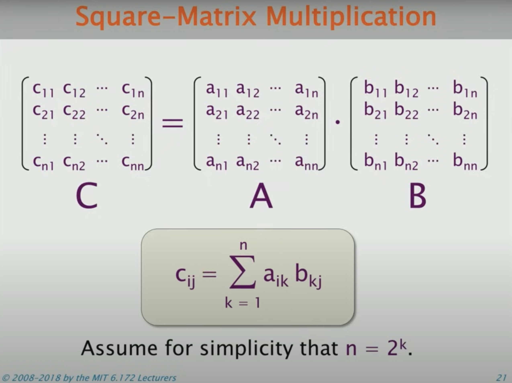
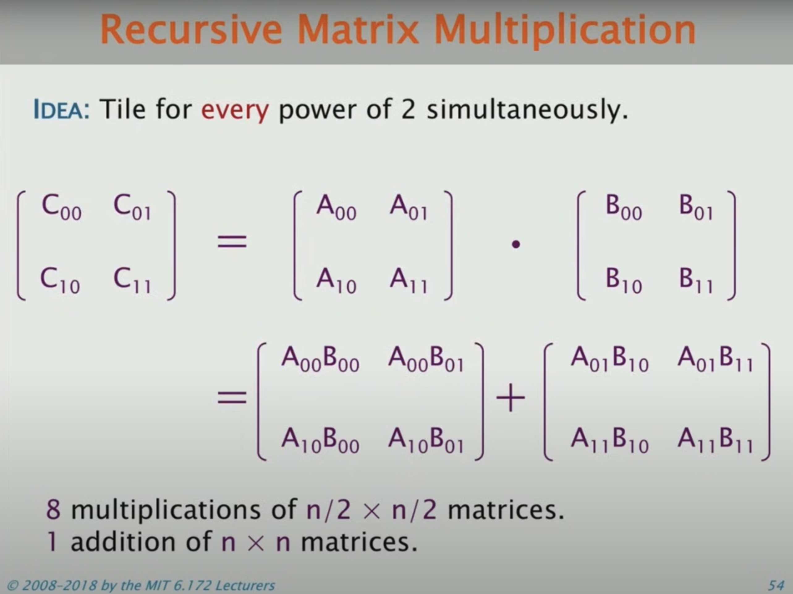
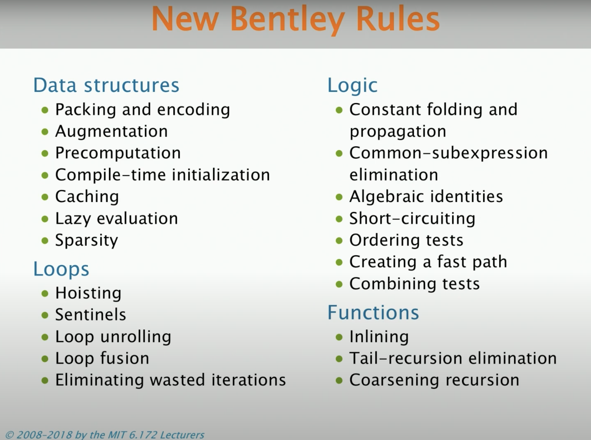
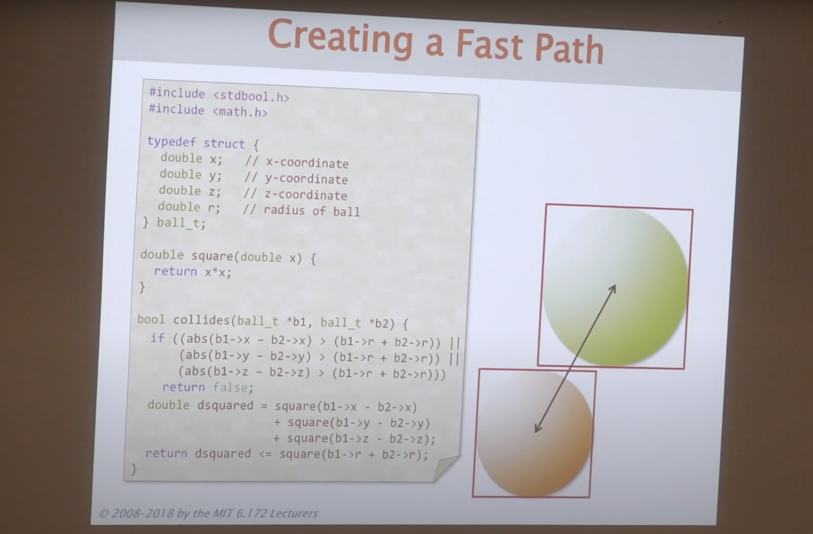
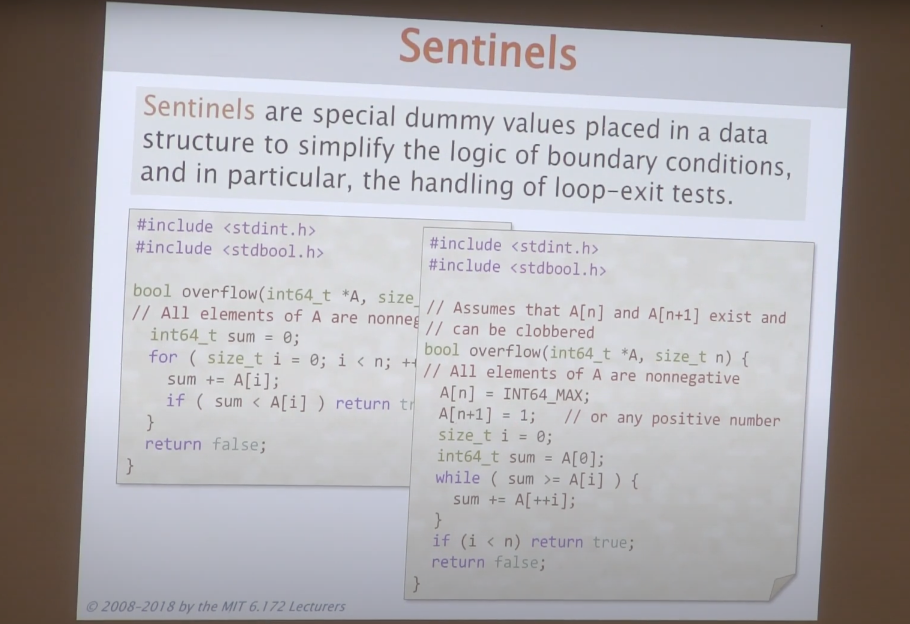
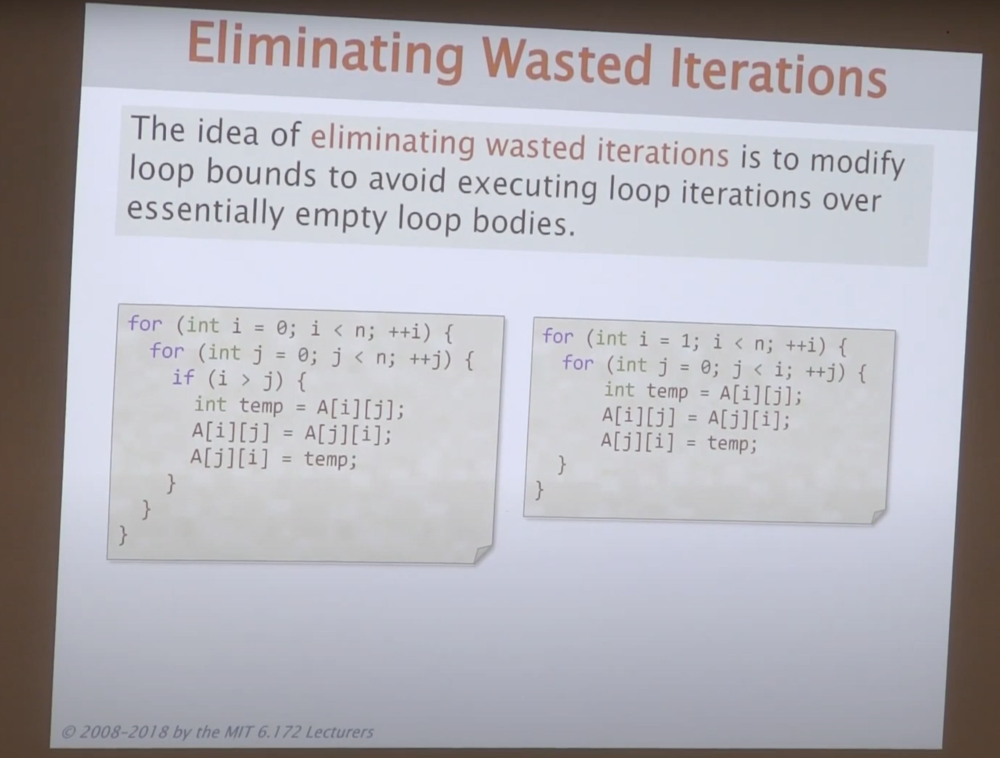
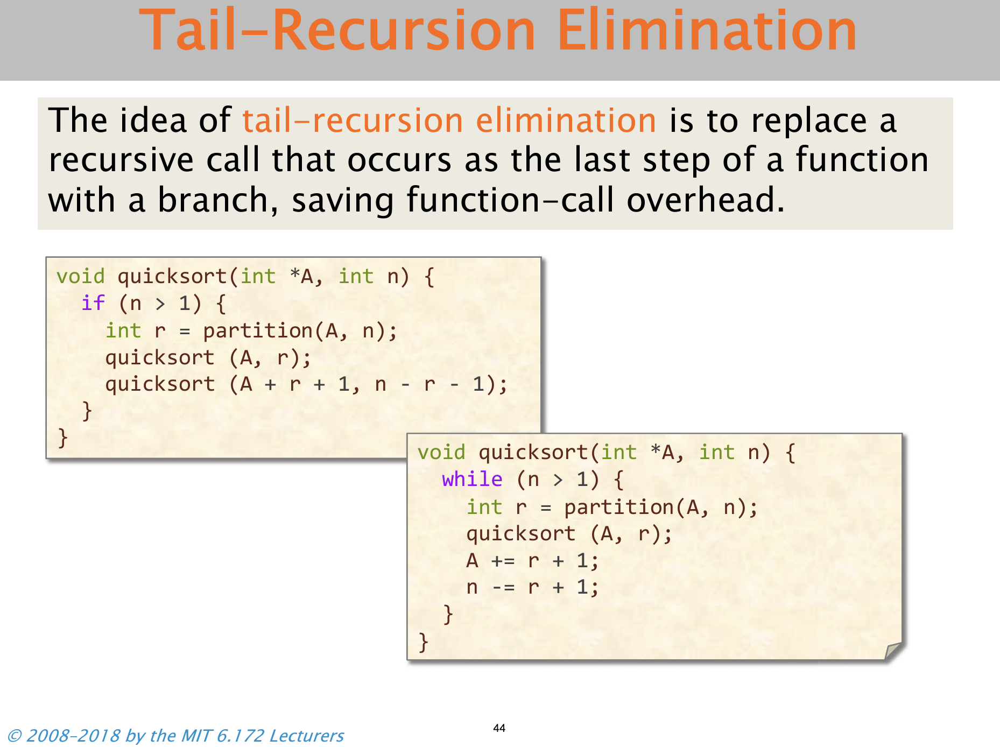

# 1. Introduction and Matrix Multiplication

- **Performance**: the currency of computing; it can be traded for other properties like readability or extensibility of code
- Until 2004, Moore's law and "Dennard Scaling" were primarily responsible for performance improvements -- hardware scaling
- More recently, parallelism and multi-core processors were introduced, but require software to utilize this hardware effectively (GPUs, FPGAs, vector units, cache hierarchies) 

## 53,292x MatMul speedup

- Python vs. Java vs. C
    - Python is interpreted
    - Java is compiled to byte-code, which is JIT (just-in-time) compiled to machine code
    - C is compiled directly to machine code

- Interpreters trade off performance for high-level features, like dynamic code alteration
- JIT compilers can bridge this gap, compile frequently used code chunks into machine code _(is this like hotspot JIT optimizations?)_
- Row-major / column-major matrices in memory
- Loop ordering is important because of cache locality
- The compiler can apply different levels of optimization (clang flag -O[0-3])
- Multicore parallelism, speedup can outweigh scheduling overhead
- Tiled matmuls, allows for fewer memory accesses by better taking advantage of the cache (using NxN blocks)
    - This can be extended for a cache hierarchy
- Parallel D&C matmul, using nxn threshold to prevent function-call overhead from outweighing improvement 

- Vectorize operations using single-instruction stream, multiple-data stream (SIMD)
    - This can be done through the compiler or manually using intrinsic instructions (AVX)

# 2. Bentley Rules for Optimizing Work
- Reducing the work of a program does not necessarily lead to a reduction in runtime; work is a heuristic for runtime due to the complex nature of hardware
    - instruction-level parallelism (ILP)
    - caching
    - vectorization
    - spectulation, branch prediction

## Bentley rules

### Data structures
- **Packing**: store more than one data value per machine word
- **Encoding**: represent data values in fewer bits
- Packing and encoding can reduce the number of memory fetches
- The optimization can also be in unpacking and decoding, when moving the data is more expensive than operating on it
- **Augmentation**: add information to the data structure, which decreases the work of common operations
- **Precomputation**: perform computations in advance, outside of the critical path
- **Compile-time initialization**: store constant values at compilation, rather than exectuion (e.g. binomial coefficients)
    - **Metaprogramming**: create code that generates source code for large static tables
- **Caching**: minimize recomputation by storing recently accessed results
- **Sparsity**: avoid storing and computing on zeroes
    - compressed sparse row (CSR) / compressed sparse column

### Logic
- **Constant folding and propagation**: evaluate and substitute in constant expressions during compile time
- **Common-subexpression elimination**: avoid computing the same expression multiple times, evaluate once and store for later use
- **Algebraic identities**: replace algebraic expressions with cheaper equivalents
- **Short-circuiting**: stop evaluation as soon as answer is known
    - && and || short circuit, but & and | do not
- **Ordering tests**: more often successful tests should precede rarely successful tests, inexpensive tests should precede expensive ones
    - Used with short-circuiting to reduce unnecessary computation
- **Fast path**: Add cheaper (not necessarily fully-encompassing) checks, useful in graphics applications
    - Add is cheaper than multiply

- **Combining tests**: replace sequence of tests with a single test or switch

### Loops
- **Hoisting (LICM)**: avoid recomputation of loop-invariants each time the body is run
- **Sentinels**: simplify logic of boundary conditions by placing dummy sentinel values in a data structure

- **Loop unrolling**: combine consecutive iterations of loop into single iteration
    - **Full loop unrolling**: unroll all iterations
    - **Partial loop unrolling**: unroll several, but not all iterations
    - Enables additional compiler optimizations
- **Loop fusion (jamming)**: combine multiple loops over the same range into a single body, saving overhead of loop control
- **Eliminating wasted iterations**: modify loop bounds to avoid executing "empty" loop bodies

### Functions
- **Inlining**: replace the function call with the function body, avoiding overhead on function call
- **Tail-recursion elimination**: replace recursive call at end of function with a branch (goto), saving overhead of function call

- **Coarsening recursion**: increase size of base case and avoiding function call overhead (e.g. recursive parallel matmul)